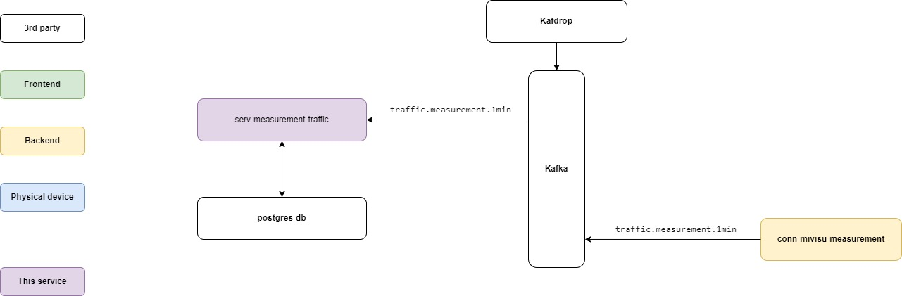
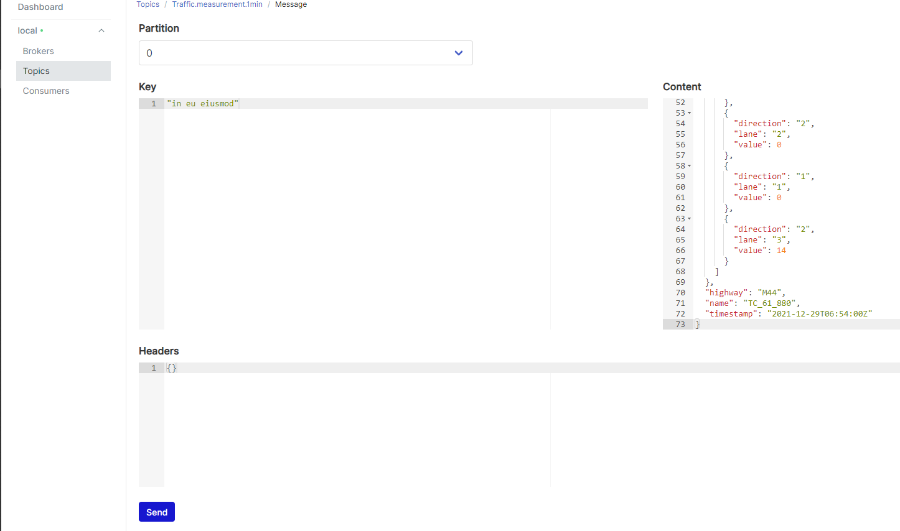
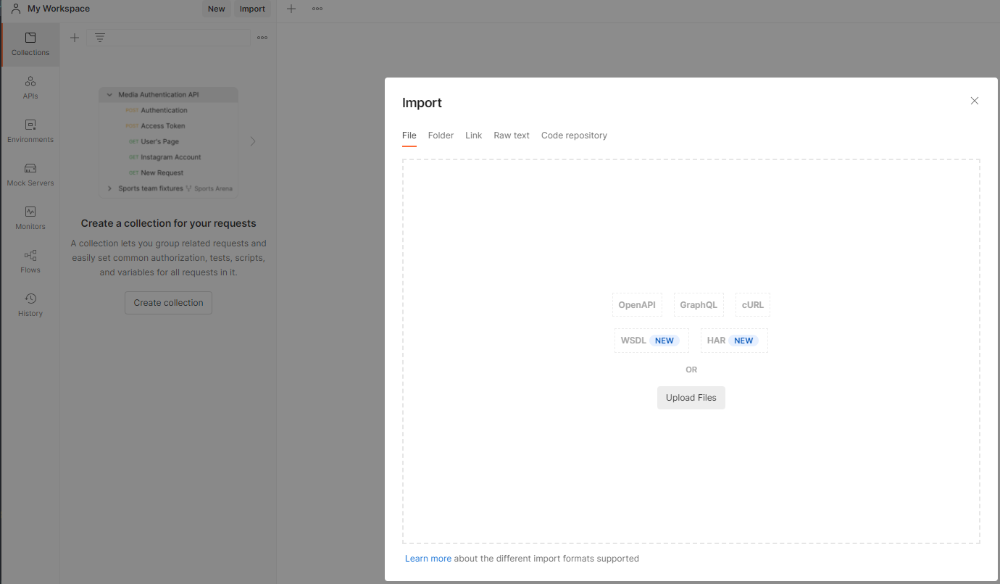
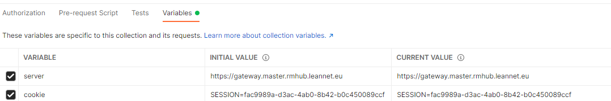
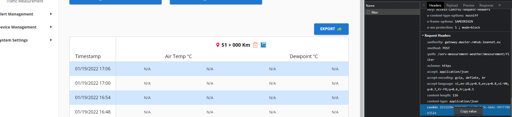
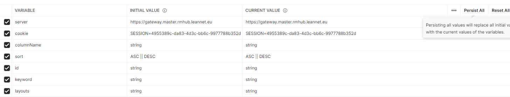

# serv-measurement-traffic

# Summary

This service provides the measurement (saturation, speed, vehicle) that is received from kafka topic `traffic.measurement.1min`

# Architecture Diagram



# Setting up local testing with Docker Compose

1. Check the `application.properties` file to have correct values:
   1. Data source configuration
      ```
      spring.datasource.url=jdbc:postgresql://localhost:5432/rmhub2
      spring.datasource.username=postgres
      spring.datasource.password=123456
      ```
   2. Kafka configuration
      ```
      kafka.bootstrap.server=${KAFKA_BOOTSTRAP_SERVER:localhost:9092}
      kafka.group.id=${KAFKA_GROUP_ID:rmhub2}
      kafka.measurement.topic=${KAFKA_MEASUREMENT_TOPIC:traffic.measurement.1min}
      ```
2. Start basic services by `docker-compose.yaml`
   ```
   docker-compose up kafka db kafdrop kafka-ui
   ```
3. Start serv-measurement-traffic in your IDE
4. Send message from folder `sample-data` to Kafka topic `traffic.measurement.1min`
   1. Go to 'localhost:8080' of kafka-ui
   2. Go to 'Consumers' section, choose rmhub2
   3. Select topic 'traffic.measurement.1min'
   4. Switch to 'messages' column
   5. Use 'Producer Message' in the corner of the screen to send sample-data in box
      'Content' with json
   6. Copy and paste each data in order in sample-data
   
5. Check database `rmhub2` to have data in 3 tables `device`, `direction_lane`, `traffic_information`

# API documentation

There are 2 ways to see API documentation:
1. From source code: see the file `openapi.yml`
2. After run serv-measurement-traffic project in your local: go to `http://localhost:8078/swagger-ui.html`

# Test data

1. Use sample data in folder `sample-data`, each file will be a sample data to send to Kafka topic 
`traffic.measurement.1min`.
2. Use file measurement-traffic.postman_collection.json to import to your Postman to test service's API
   1. Import file measurement-traffic.postman_collection.json

   

   2. Click on folder serv-measurement-traffic, switch to variables

   

   3. Copy cookies on the website

   

   4. Paste cookies into current-value of `cookie` and persist-all, change current value of `server` to 'localhost:8078'
      to test on local and persist-all.

   

